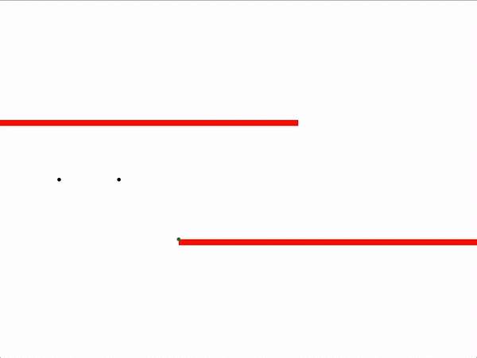
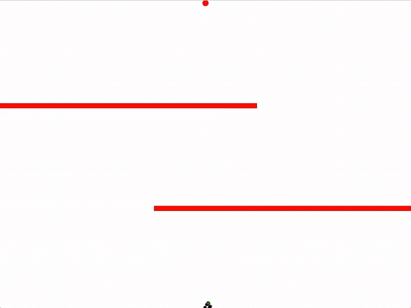

# genetic-machine-learning-visualisation

A visualisation of a genetic machine learning algorithm to solve a simple pathfinding problem.

**Technologies used:** React, Electron, TypeScript, Webpack

*starting with random motion*

*continuous optimisation towards the shortest possible path*